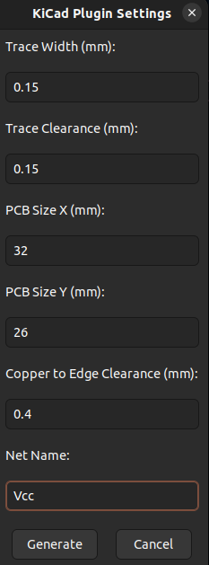
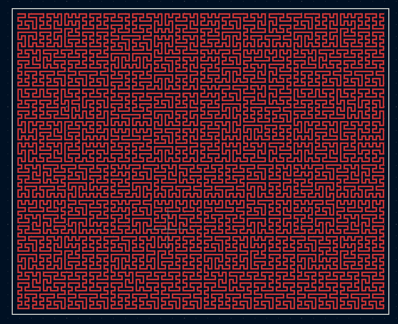

<a href="https://www.flaticon.com/free-icons/heat" title="heat icons">Heat icon created by Smashicons - Flaticon</a>

### Features

#### Supported (2D) Space-filling curves
- Generalized Hilbert ("gilbert") Curve. Algorithm implementation by [jakubcerveny](https://github.com/jakubcerveny/gilbert)

#### PCB Shape Options
- Rectangle
- (Edge cuts generated with the heater)

#### Trace Options
- Trace Width
- Trace to copper clearance
- Trace to PCB edge clearance
- Net name

#### Future Work
- Space-filling curves: addition of different curves
- Trace Option: ability to choose specific heater total resistance using different manufacturing capabilities
- MISC: More error logging

 

  
  

### Installation

- Install python requirements from `requirements.txt` by executing `pip install -r requirements.txt`
- On the top left toolbar of the KiCad PCB Editor, go to `Tools->External Plugins->Open Plugin Directory`
- Copy and paste the `Heater_Generator_Plugin` directory inside the plugin directory (unzipped)
- Press `Tools->External Plugins->Refresh Plugins`
- The Heater Generator Plugin should be visible on the top right with its red heater icon

